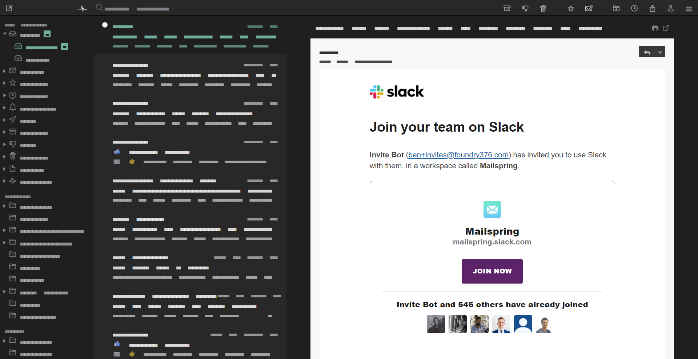

# Minty for Mailspring

A minty dark theme for the [Mailspring](https://getmailspring.com/) email client, based on the excellent [Predawn](https://github.com/asparc/predawn) theme.

# Installing

1. Download the [Mailspring](https://getmailspring.com/) email client.
2. Download or clone the latest version of the Minty theme from <https://github.com/michaelhthomas/mailspring-minty>.
3. Open `Mailspring > Edit > Install Theme...` and select the folder you just downloaded.
4. Enjoy a polished dark theme that's easy on your eyes!

## Accent color

It's quite straightforward to replace the mint accent color with another color of your choosing:

- Replace all occurrences of `@mint` and `@mint-prefilter` in `styles/ui-variables.less`.
- Change the color of all mint icons in `style/images`. 

That's it!
